# T1A3 - Terminal Application

#### Coder Academy Sydney Fast-Track Bootcamp 2021

##### Garvey Chan

# Terminal Trillionaire

## Software Development Plan

[GitHub Link](https://github.com/garvdev/terminal-trillionaire)

[Alternate GitHub Link](https://github.com/garveycodes/terminal-trillionaire)

[Trello Link](https://trello.com/b/rfHyAJYC/)

#### Background / Purpose / Scope

**Terminal Trillionaire** is a command line application developed in one week as an assignment for Coder Academy's Fast Track Program in 2021. At a high level, this application is intended to provide a simulation of real-world market security trading dynamics. Given the tight deadlines, the functionality covers simplistic elements of securities trading - basic portfolio management, buying/selling, and market data. However, it should serve as a useful introduction to the industry with future incarnations of the program delving into more complex topics.

This application is aimed at anyone who might have an interest in the finance industry, specifically securities trading/investment, and all the considerations to be made when engaging in such activities. Like software engineering, the world of finance can often be intimidating, filled with jargon and nuance which can be overwhelming for newcomers. As a fast-paced industry with far-reaching implications where transacting can come with enormous risk, it's no wonder that many people find themselves avoiding the subject entirely. With this application, I hope to provide a frictionless gateway through which people can familiarise themselves at a comfortable pace and work their way towards prudent and calculated financial risk-taking.

The application seeks to achieve its purpose with a thoughtful user interface, which has been designed to be as intuitive as possible for the optimal user experience. Every component of the application has been carefully considered to maximise user engagement and provide depth to the numbers on the screen. The intent is for there to be two different experiences which the user can migrate between as desired. These have been designed to align with two distinct disciplines in investing - **short-term trading**, which attempts to capture instantaneous profits by exploiting market dynamics with high speed tools and analysis, and **long-term investing**, which refers to buying into companies for longer periods of time to take part in their growth and reap rewards in the form of dividends.

The short-term trading element is expected to be action-packed and exciting for the user, as they navigate the market and engage in fast-paced trading activity to strengthen their portfolio. The long-term investing element is facilitated by the persevering nature of the application, underpinned by scalable design and simulations based on a mathematical model which extends indefinitely without database maintenance. A robust portfolio management system helps bring these two dynamics together, allowing the user to record their progress and watch as their holdings advance over time, providing further incentive for the user to return.

#### Features

The main features of **Terminal Trillionaire** are as follows:

##### Live Market Feed

The market view will provide a real-time rapidly updating catalogue of securities and their corresponding prices. The securities will be identified by their **ticker** on the stock exchange, followed by a series of prices at various timestamps so that the user can identify the current price and perform trend analyses to inform their decision making. The backbone of this feed will be a mathematical model which can be called upon rapidly to generate simulated prices based on the current time. By leveraging the `Time` object to calculate prices in real-time, it effectively becomes a pseudo-database for consistent prices that each terminal can drawn upon, enabling a single market environment across all machines running this application. Users can therefore compete fairly against each other without any communications link.

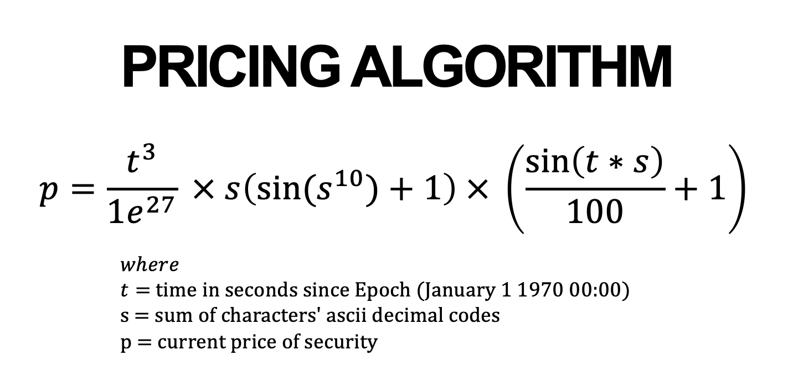

*Note that this algorithm is very simplistic and assumes continuously linear growth of the underlying asset.*
*Further details can be found in the experimental section of `./docs/`.*

##### Trading Platform / Portfolio Management

The trading platform will provide users with the ability to buy and sell securities from the market as they please. A brief summary of the user's holdings will be displayed along with their cash balance in order to support their decision making. By following the guided prompts, the users will be able to select securities that they wish to transact with and specify the quantity that they wish to purchase or sell. The brokers will provide prices based on the selected criteria and the user can then evaluate all the information available in order to make an informed financial decision. Executed trades will then be processed through the portfolio management system to ensure user states are preserved accurately.

##### Portfolio Analysis / Historical View

Further information on a user's holdings will be found in the Portfolio Analysis and Historical View sections. The portfolio will outline a user's existing positions, detailing the quantities, cost bases, current prices, and total values of each security. A chart will also be displayed to break down the portfolio by percentage of each holding, along with a summary of the potential profit/loss of each security should the user decide to liquidate their holdings at any given point in time. The historical view will provide a comprehensive list of all trades executed by the user to demonstrate how they reached their current position.

#### User Interaction / User Experience

As an educational experience, the application will be designed to be as intuitive and accessible as possible. A brief **narrative** will be displayed to provide users with a theatrical experience as they are **proactively guided** through each phase of the application, from onboarding to trade execution. Graphical elements such as **pie charts** and **progress bars** will provide further context and increase user immersion.

Once the user logs in, they will be taken to the **console** where they'll be greeted by the **assistant** who provides them with a series of options for how they'd like to proceed. These prompts will take the user to one of the features specified above and the assistant will follow along to provide assistance along the way.

Additionally, a **help section** will be provided from within the application to outline every aspect of each feature and provide useful context to help drive the formation of the user's mental model for how each element interacts with one another.

The majority of **errors** will likely occur during the user input sections of the application. A large portion of these will be mitigated by the use of **prompts**, limiting the user input to the options provided. In stages where this can't be utilised, such as username input and trade quantity queries, errors will be handled gracefully with all **edge cases** considered. Robust validation methods involving **regular expressions** and **whitespace removal** will ensure that the application only accepts input which satisfies **syntactical** and **logical** criteria. Any issues will cause the application to raise exceptions and request remediated input.

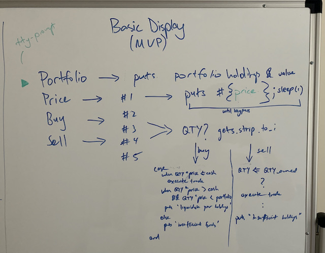

*User Prompt Brainstorming*

#### Control Flow

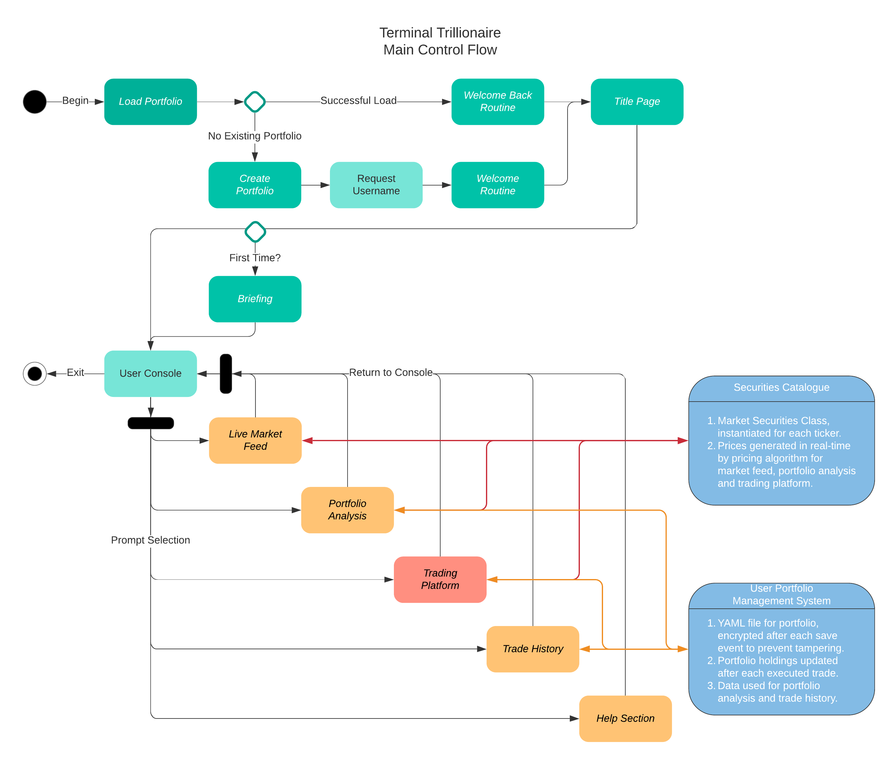
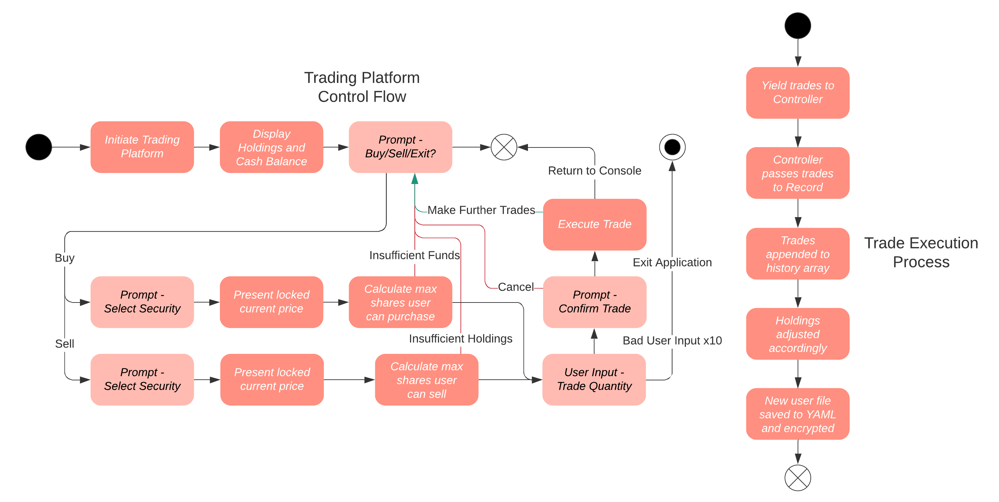

*Note - Quick routing made possible by command line arguments.*
*User can skip entire introduction stage (green) and start the application at their desired feature.*

#### Implementation Plan

The development of this application will be split into few distinct stages based on the **Agile** approach. As I am still learning various concepts in Ruby and the Terminal, I figure that an iterative and flexible approach will allow me to maximise my return on effort as I expect to be changing my requirements as I discover new functionality and the limitations of the tools available to me. Noting the 1.5 week timeline, this assignment represents a Minimum Viable Product with additional features to be implemented at later dates.

For the Agile approach, I have defined several user/client stories to help determine my requirements for the application:

**User Stories**
- As a user, I want to view the latest market data, so that I can make informed trading decisions.
- As a user, I want to view my portfolio, so that I can evaluate my current holdings.
- As a user, I want to save my portfolio, so that I can return to the simulator at a later point in time.
- As a user, I want to quickly execute trades, so that I can have fun.

**Client Stories**
- As the client, I want to simulate a large basket of securities, so that users have a variety of options.
- As the client, I want to simulate realistic market movements over extended periods of time, so that there is a sense of purpose and realism.
- As the client, I want to simulate volatile market movements over short periods of time, so that my users can actively trade securities in a meaningful way.

**Features Implementation Checklist**
- **Live Market Feed (by Tuesday April 6 2021)**
    - Develop Pricing Algorithm to generate security prices effectively.
    - Create Class model for Market Catalogue, Security Instances, and Security Prices.
    - Write Rspec tests to verify model is reliable and valid at scale (benchmark).
    - Integrate Pricing Model into Console/Controller.
    - Implement view of live market feed with real-time screen updating.

- **Trading Platform / Portfolio Management (by Friday April 9 2021)**
    - Define trade execution control flow and refine user interface/experience.
    - Design appropriate data structures for portfolio management.
    - Implement YAML file save system with light encryption to prevent tampering.
    - Outline user onboarding logic and new portfolio creation.
    - Develop buy/sell functionality - fetching input via Views, passing them through the controller and saving them in the Model appropriately.
    - Write validation methods for all user input and error handling methods to prevent misuse of application.
    - Test error handling for user input with Rspec.

- **Portfolio Analysis / Historical View (by Friday April 9 2021)**
    - Design portfolio analysis view.
    - Implement table to display current portfolio statistics, drawing on current price data from pricing model.
    - Implement portfolio breakdown visualisation using pie chart (Ruby gem).
    - Develop projected profit & loss summary based on real-time price data and holdings.
    - Implement full trade history view to list every trade performed by user.
    - Polish formatting of all graphical elements to improve user experience.

**Project Management** and **Prioritisation** for this application will be conducted using the **Kanban** method via a **Trello** board (link at the top of the page).

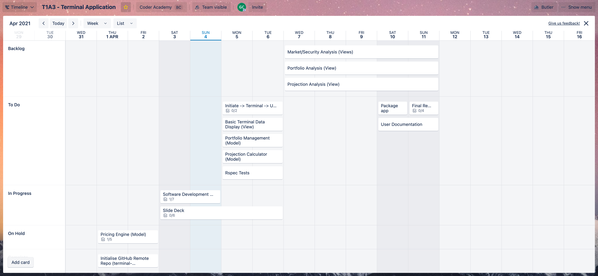

##### Post-Mortem

The first two columns of the board listed **Research** topics and **Questions** to further my learning before the implementation phase. Following these were the standard Kanban-style categories, from backlog to complete. Backlog specifically contained features which stood to add little value in the context of the assignment but would be useful for improving my technical abilities later on.

#### User Documentation

**Installation**
- In order to run this application, you must first have the following software installed on your machine:
    - **Ruby** - https://www.ruby-lang.org/en/documentation/installation/
    - **Bundler** - Bundler is a Ruby Gem manager for projects. It is itself, a Ruby Gem and can be installed with the terminal command `gem install bundler` once Ruby has been installed.
- Once this has been completed, you can `clone` this repository to your desired folder from the links at the top of the page.

**Dependencies**
- This application requires that you have the following **gems** installed:
    - `tty-table` `~> 0.12.0`
    - `tty-progressbar` `~> 0.18.2`
    - `tty-pie` `~> 0.4.0`
    - `rspec` `~> 3.10`
    - `curses` `~> 1.4`
    - `symmetric-encryption` `~> 4.3`
    - `tty-prompt` `~> 0.23.0`
    - `colorize` `~> 0.8.1`
    - `tty-cursor` `~> 0.7.1`

**Running the Application**
- Navigate to the `/bin/` file and locate the `RUNME.sh` script.
- This script will verify that you have the required **gems** installed using `bundle check`, and automatically run `bundle install` to install any missing gems if necessary.
- If there are no issues, it will begin the application.
- Alternatively, you can simply execute the `terminal-trillionaire` file.
- Note, to run either file for the first time, you may need to amend their permissions to allow them to be executed. This can be done by using the `chmod +x <file>` command where `<file>` is the file in question.

**Advanced Users - Command Line Arguments**
- This application has been designed to accept **command line arguments** to quick route advanced users straight to their desired functionality.
- For example, if the user wishes to skip straight ahead to the portfolio view, they would execute the application in the terminal and add '-p' as an argument.
- The application will interpret the argument and take the user straight through to their portfolio analysis, bypassing the title page and Fjordan's wonderful hospitality.
- A full list of arguments is as follows:
    - -m(arket) => Market Feed
    - -p(ortfolio) => Portfolio Analysis
    - -b(uy) ____ => Attempt buy order for security ____
    - -s(ell) ____ => Attempt sell order for security ____
    - -l(og) => Trade History
    - -h(elp) => Help Section

**System Requirements**
- It is recommended that you run this application through a ZSH terminal on a machine operating with macOS Big Sur v11.2.3 or later.
- Note that the application is best experienced in a full-screen terminal with an appropriate font.

#### Screenshots

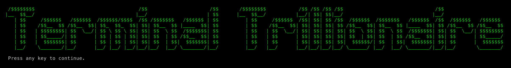
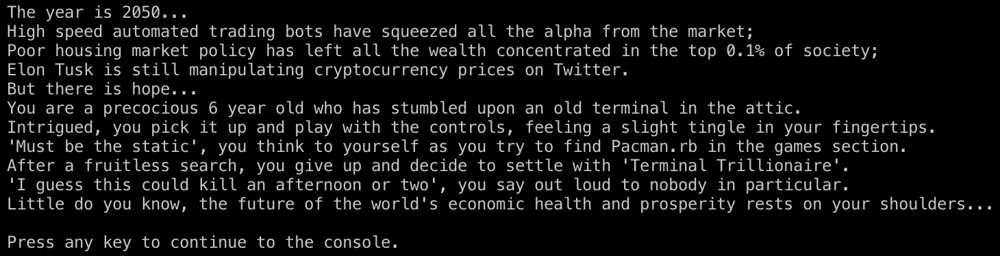
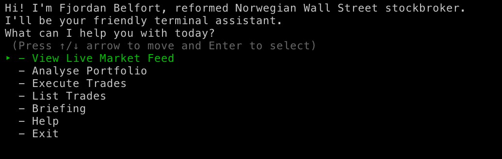
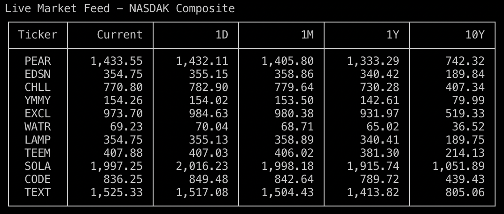
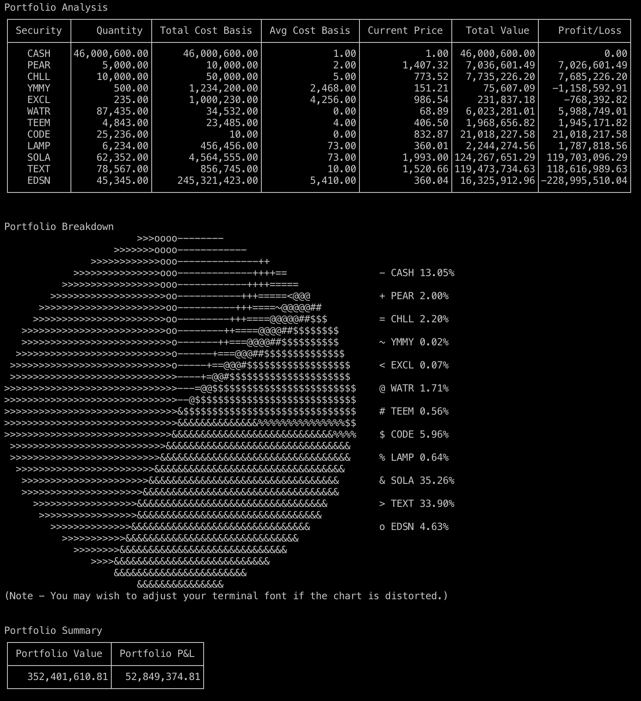
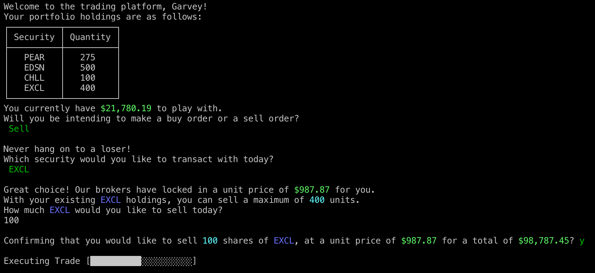
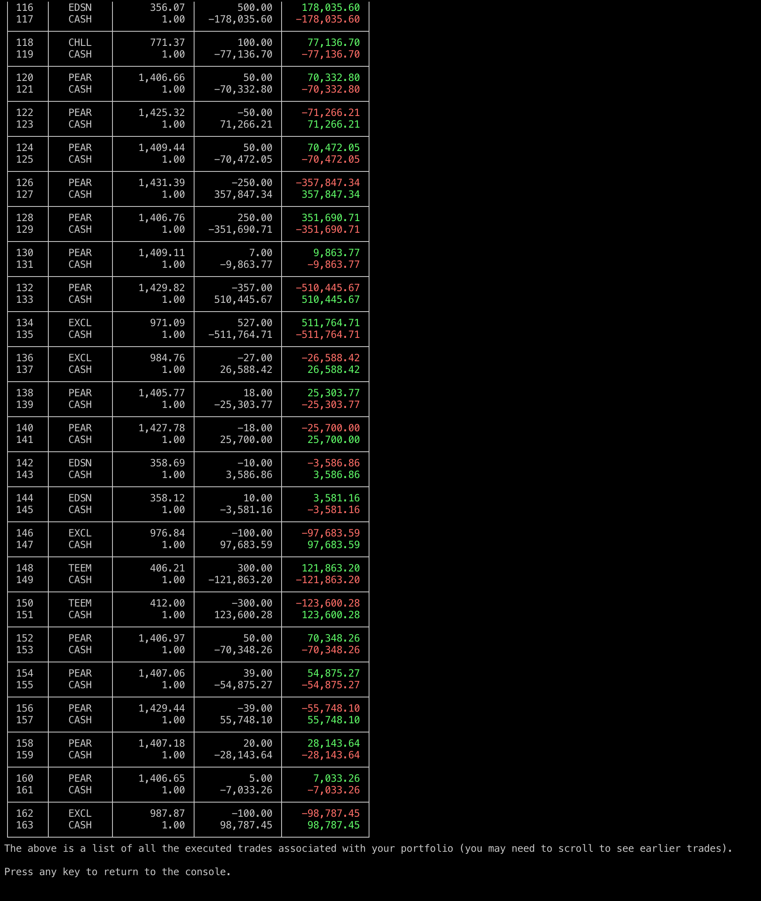
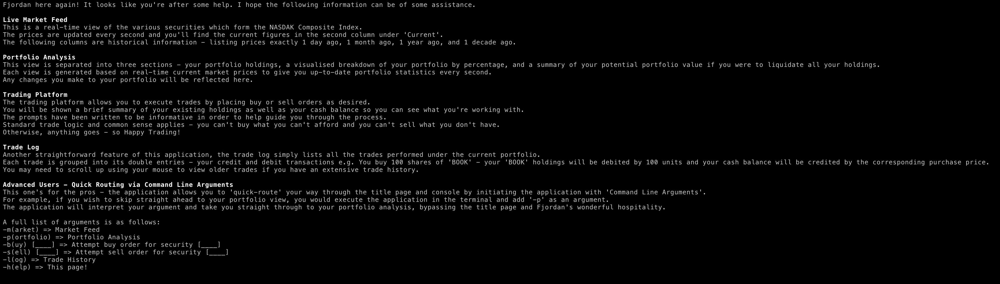

#### Attributions

ASCII Title Art - https://patorjk.com/software/taag/

Number Formatting Regex - https://github.com/tararico/yukichi
